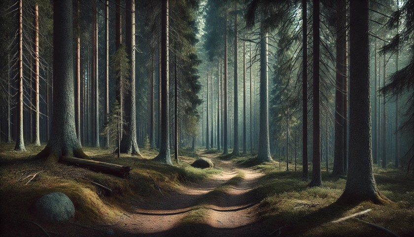

# Казка про шляхи

## Глава перша

### Частина перша. Дім.

Аші закінчила хазяйнувати у вітальні, обтрусилася від пилу, задумливо підійшла до вікна і сіла на підвіконні. На вулиці був тихий та заспокійливий літній день. Сонячні промені мерехтливо пробивалися крізь розкидані хмаринки і красиво підкреслювали одиноку осику що росла на пагорбі. Легкий вітерець колихав некошений луг. Навіть Великий Ліс на обрії, що завжди трохи лякав, та всім своїм видом застережував що зайве в нього краще не суватися — виглядав майже привітним і домашнім. Аші із сумом подивилася на стару занедбану ґрунтовку що вела до будинку — кущі реп'яшнику вже майже сховали її під своїм листям. Проте, ще де-інде, дорога пробивалася назовні — нагадуючи про часи коли по ній було кому їздити. Але люди давно забули про це місце — хтось поїхав, хтось пішов. Останній гість мабуть був вже майже півтора роки тому — місцевий фермер: Семуель. Його сім'я жила вже декілька поколінь десь за пів години пішки. Діти, двійнята: Ліза та Стефан, Аші їх дуже любила — давно виросли і поїхали з острову. Дружина померла від хвороби кілька років тому. Семуель… Аші не знала що трапилось з Семуелєм. Того дождливого вечора він заїхав в гості, але навіть не заходив. Просто віддав ключі від будинку, попрощався, і не відповівши на жодне питання — поїхав. На всю округу вони залишились вдвох — з її домашньою улюбленкою Тіною. До початку цього літа.

Аші подивилася на тіні від реп'яшнику, ніби сподіваючись побачити Тіну. Потім струхнула головою — Тіна не прийде. Вже декілька місяців як вона пішла — і не повернулась. Звісно, і до цього так бувало що Тіна пропадала на день, два, декілька разів — навіть майже на тиждень. Але вона завжди поверталась. І завжди зразу бігла до Аші — ластилася до неї — розповідала де була, що робила і як сумувала. Аші в свою чергу теж казала що теж дуже-дуже сумувала, і просила більш так не робити. Тіна її уважно слухала і робила вигляд що все розуміє. Мабуть, зі сторони, цей діалог між кішкою та дівчиною виглядав трохи кумедно, але якщо подумати: коли проживеш стільки років разом — для спілкування слова особливо і не потрібні. З ними просто іноді простіше. Та й зі сторони дивитися не було кому.

Але того разу Тіна пішла — і не повернулася. Аші безплідно, кожен вечір чекала її біля дому. Бігала, шукала по навколишнім полям, навіть пішла до Великого Лісу — Тіни й сліду не було. Надія знову її побачити згасала повільно, але незворотньо — Аші, при всій своїй романтичній натурі, була реалісткою. Хоча іноді, як от сьогодні, їй хотілось посидіти на підвіконні і пороздивлятися околиці, уявляючи як з-за повороту несподівано вийде Тіна і побіжить до неї.

Сонце поволі йшло по небосхилу — день добігав краю, тіні почали подовжуватись та рожевіти. Поодинокі хмаринки перетворилися на красиву стелю з купчастих гір. Аші розплющила очі і почала дивитись на захід сонця. Сон ще не до кінця відпустив її — вона не пам'ятала що їй наснилось, розуміла тільки що щось приємне і тепле. Але сон потроху відходив, і з ним зникало солодке відчуття спокою і щастя. Вона знову подивилась на вулицю — тінь від реп'яшнику майже повністю приховала дорогу. Аші зітхнула, хильнула головою відганяючи залишки сну, та перевела погляд в середину будинку. «Це все — щось з минулого життя», — мимоволі подумала вона. Від цієї думки на душі зразу пусто, але… спокійно. «Це все — щось з минулого життя», — тепер вона це промовила в голос, відокремлюючи кожне слово. 

— Бувай. — сказала Аші будинку і подивилася на двері.

### Частина друга. Ліс.

Великий Ліс не задарма називався Великим. Наскільки знала Аші — він простягався смугою через весь острів, відокремлюючи Північні Гори та Столицю від південних селищ. Але він звався Великим не тільки через це. Вікові дерева сягали неба. Тут, на землі, між ними можна було побудувати цілий будинок, але там, нагорі, де вони торкалися сонця і мали можливість розкрити всю свою силу — вони це й робили. Величезні крони, немов дах, застеляли все небо. Жодна злива, жоден буревій не могли пробитися через цю міць сюди, донизу. Поодинокі промінчики заполуденного сонця досягали землі, підсвітлюючи мшані пагорби та зарості чорничника. Підліску майже не було — жодне інше дерево не витримувало конкуренції з віковими соснами Великого Лісу — корінними володарями цієї землі. 

Аші йшла дорогою, обережно роздивляючись навколиці — в Великому лісі жили не менш великі звірі, як раптом почула скрип колес. Швидко сховавшись за деревом, Аші обережно виглянула зза стовбура. Дорогою їхав дерев'яний віз запряжений двома кіньми. На ко&#769;злах сидів сивий чоловік з пов'язкою на лівому оці.

«Цікаво. — подумала Аші. — Віз з кіньми? Де вони це все знайшли?», — Аші продовжувала обережно слідувати за несподіваними гістьми. Повозка зупинилася футів за шістдесят від сосни за котрою сховалася Аші. Чоловік накинув повіддя на поруччя, покопався під сидінням, дістав пляшку, відкупорив — та зробив смачний ковток. Потім подивився прямо в сторону Аші і промовив: 

— Я тебе бачу. А ще ти занадто голосно дихаєш.

Аші зомліла. 

— Давай знайомитися, — продовжив одноокий. – Лестер. А тебе як звуть?

Аші обережно вийшла зза дерева і мовчки подивилася на одноокого.

— Дуже приємно, — як ні в чому не бувало продовжував Лестер. — Заблукала, чи до міста йдеш?

— Так. — Аші обережно кивнула.

— Ну да, а що я сподівався почути коли таке питав, — посміхнувся Лестер. — Підвезти?

Аші нічого не відповіла.

— Диви, — Лестер показав пальцем небо. — Вже за полудень. Ти справді хочеш ночувати в лісі? 

Аші подивилася в гору — сонце ще було високо, але було прям бачно, як воно вже готується почати замальовувати верхівки дерев у рожевий колір.

— Тобі до міста ще день йти, якщо не більше, — продовжував Лестер. — Сідай позаду, на вантаж — там місця багато. 

Аші ще раз подивилася на Лестера, на віз та на дорогу. Вона ще ніколи не заходила до лісу так далеко. Максимум куди вона ходила пішки — через поля, до найближчого селища, за чверть дня дороги. Звідти можна було дістатися до Столиці на автобусі, але він ходив раз на тиждень… — і Аші не захотіла чекати. Що ж, якщо все зважити… Дорога з однооким виглядала більш безпечною, ніж перспектива самій ночувати в Великому Лісі.

— Ще раз запрошувати не буду. Їдьмо?

Аші обережно кивнула і пішла до возу.

— А ти не говорлива, — зауважив Лестер. — Може це й на краще.

### Частина третя. Віз.

Аші прокинулася, але не подала виду. Віз тихо їхав лісовою дорогою, Аші лежала на великій дерев'яній коробці з написами «ОБЕРЕЖНО — КРИХКЕ», та стрілкою «ВЕРХ ТАМ» — дбайливо спрямованою в горизонт. Лестер продовжував травити історії зі свого насиченого життя:

— … і ось тут я починаю панікувати. Розумієш, це ж був один з тих рутинних нічних патрулів. Нічого ж незвичайного, так? А тут цей стрьомний шелест з провулку. Серце калатає, інстинкти кричать — бий, а потім дивись. Але я обережно підходжу, готовий до всього. І тут, ні звідки, звичайний кіт — звичайнісінький сірий кіт — вискакує на мене. Трясця! Можливо, ти думаєш, що це ще нічого, але ця падлюка має такий блиск в очах, що ніби знає про мене ВСЕ! І ще щось, чого я і сам не знаю. І перш ніж я встигаю щось зрозуміти — як я заплутуюсь у власній мантії і падаю на спину! А воно вже тріумфально сидить на моїх грудях і дивиться мені прямесенько в очі! Мені потім знадобилося хвилин десять, щоб виплутатись та прийти до тями! З тих пір я пильно стежу за бездомними котами. Ніколи не знаєш, що може ховатися за тими невинними вусиками.

Тіна… Як це було приємно, лежати з Тіною… На грудях… Аші тихо заплакала.

— Трясця. Щось не те сказанув, — Лестер обернувся до Аші. — Вибач, бачу що тобі боляче. Але ти виберешся — такі як ти чи я завжди вибираємося. От у мене була історія, ти не повіриш. Коротше, дали одного разу мені групу студентів… 

Але Аші вже не слухала. Вона дивилася за спину Лестера, на дорогу. Десь там її чекало місто і нове життя. «Виберуся... Звісно виберуся, що ще робити. Вибач, Тіно…». Сонце вже зникло з неба, але все ще нагадувало про своє існування зафарбованими верхівками дерев. Повороти міняли один одного. Віз, що дбайливо похитував по дорозі, та далекий шерхіт крон робили своє діло. Аші знову заснула.

## Глава друга

### Частина перша. Полон.

— Де вона кажеш!? Хапай! 

Аші не встигла прийти до тями, як її грубо стягли з коробки, скинули та притисли до землі замотавши рота ганчіркою. Вона очманіло почала озиратися. Декілька молодиків в шкіряних куртках та штанях метушилися кругом воза. Один вже відводив коней в сторону, двоє відв'язували коробку.

— Швидше, тягни!

— Та не знімай поки. Почекай транспорт — зразу перекинемо.

— Мотузки підбери — кинь до воза. Разом спалимо. 

— Що з цією робити? — Один з молодиків вказав на Аші та подивився на Лестера. Лестер стояв поруч воза, крутячи в руках пляшку та відчужено спостерігаючи за метушнею.

— Мені вона зараз не потрібна. Але поки не вбивайте. Може потім — я скажу.

— Віддамо босу. Бос таких любить, — криво посміхнувся один з молодиків, судячи з усього — головний.

— Можна й босу, — задумливо відповів Лестер.

Він підійшов до Аші і подивився їй у вічі:

— Вибач, мала. Нічого особистого. Просто зайвий свідок. Чи шпигун, хоча… — не думаю. Знаєш: тримай друзів близько, а ворогів — ще ближче. Можливо, тобі просто не повезло опинитися в непотрібний час в непотрібному місці. Так буває.

В лісі почувся шум мотору. Лестер напрягся: 

— Це що? — подивився він на головного молодика.

— Транспорт. — Відповів той, прикурюючи цигарку.

— Який, збіса, транспорт?!! Машина?!!

— Ну да, іншого не знайшли. Колимага років сорокових — не хвилюйся.

— Умова була — жодних маглівських приколів! Жодних двигунів чи електрики! 

— Та воно старе, на дизелі. Там з електрики — хіба що ліхтарі.

— Ти розумієш, що з цим вантажем — ці ліхтарі боком тобі вилізуть, причому в прямому сенсі? 

Лестер поліз до кишені за стільниковим — зупинився і різко глянув на Аші:

— Приберіть її звідси.

Головний молодик кивнув одному з хлопців — той моментом підбіг до Аші і накинув їй на голову мішка.

### Частина друга. Бос.

Аші сиділа у якомусь підвалі, в кімнаті розділеною навпіл щільною решіткою. Насправді, вона не була впевнена що це саме це підвал, але інтуіція та важке повітря натякали на те що ймовірніше вона знаходиться все ж таки під землею ніж над. Жодних вікон — тільки великі металеві двері по інший бік грат. В кутку стояла вода та лежала половина жареної курки на тарілці — Аші не торкалась, хоча і була голодна.

Засув на дверях скрипнув — Аші кинулась до кутка і напружилася. Засув скрипнув останній раз, двері відчинилися і в приміщення зайшла висока людина у чорній куртці з капюшоном. Обережно зачинивши двері, людина повернулася до Аші та скинула капюшон. На Аші дивилася дівчина з довгим чорним волоссям та проникливими зеленими очима, на дні котрих грала пустота та рішучість.

— Дибіли. І що мені з тобою тепер робити?

Вона підійшла до грат, присіла, просунула руку крізь решітку — відірвала шмат курки, так почала смачно його їсти. 

— Їж, не бійся. Не отруєно. 

Аші не поворухнулась. Дівчина доїла курку, викинула кістку в куток кімнати та сіла на підлогу, опершись спиною на стінку.

— От розумієш. Вже понад двадцять років пройшло. Двадцять! А ці довбні ніяк не вгамуються. Жарти в них.

Вона дістала цигарку: «Не заперечуєш?» — та не дочікуючись відповіді запалила.

— Молодою була — дурною. Мамка в мене ще той фрукт була, хоча подумати — з цим кодлом і не такою станеш. А мене обожнювала — все дозволяла і все дарувала. І от одного разу, приводить вона мені дівчинку. Каже — на тобі подружку. Особисту. Буде в тебе тепер іще одне звірятко, і підморгнула. Пожартувала… А в мене тоді було дві собаки, п'ять котів, папужник, своя конюшня, навіть два олені, уявляєш? Специфічний у мамки гумор був… А дівчинка молода, вродлива — білявка голубоока. Вся така тендітна й правильна. Біле вдягати ще любила дуже.

Вона затягнулася цигаркою і пустим поглядом вперлася в стінку навпроти.

— Хєрова історія у тієї дівчинки була. Був у неї хлопець, одноліток. Так його у неї лярва одна уве&#769;ла. А йому то що — лярва хоч і не молода, проте з грошима: машину йому подарувала, будинок. І на мет підсадила — щоб не втік. Це я потім вже дізналася. Лярва та — відома особа в вузьких кругах була, — дівчина глянула на Аші. — Порошком торгувала на пів світу. «Біла королева» себе величала. Ага, «Королева». Ми заочі її «Cніжком» називали, — дівчина посміхнулася. – Та ще кулька була. 

— Вони не місцеві були, десь с півдня, — продовжила дівчина. — Пів Європи за хлопцем своїм проїздила — повернути хотіла. Вже на грані була: їсти то хочеться, а вона ж вся така правильна… Не витримала, пішла роботу на ніч шукати — і мамку мою зустріла. Та тоді її прямо з рук двох якихось вилупуків вирвала. Стрельнуло у мамки щось тоді…

Дівчина задумливо роздивилася тліючий кінчик цигарки.

— Привела вона її до мене. Типу — буде тобі іграшка, а потім може й зробиш з неї для себе щось путне. Мамка бачила, що дівчина то насправді сильна і розумна — просто за коханням голову втратила. Не вга-да-ла. Мене тоді так на цю всю романтику розвезло… Я сімейну справу ледве в прірву не спустила! Зі «Cніжком» потім ще років зі п'ять гризлися. З тих пір — жодних подружок чи звіряток, — дівчина зробила глибоку тягу. — Хоча свого хлопця вона таки повернула…

Дівчина затушила цигарку об підлогу, стрельнула недопалок до кістки в кутку, встала — потягнулася та тупнула ногою. 

— Це сто років тому назад було! А ці довбні пам'ятають! Навіть ті, що тоді ще під стіл пішки ходили, знають! І постійно! Постійно тягнуть до мене дівчат, котів, собак, навіть оленя одного разу приперли!!! Щоб не забувала. Дибіли.

Вона протягнула руку до Аші: 

— Уіверпі. Знаю, важко вимовити — папка датчанином був. Можна просто Уів.

Нагорі роздався вибух, зі стелі посипалась штукатурка — світло в кімнаті блимнуло та погасло.

### Частина третя. Наслідки.

— Ссука… Ти жива? — Нічого не бачу.

— Жива, — тихо відповіла Аші намагаючись зорієнтуватися.

— Гаразд. Навряд це за тобою — забагато спецефектів. Зараз я тебе відчиню — без дурощів, добре? Бо поріжу.

— Добре, — Аші обережно пішла на голос Уів.

Почувся брязкіт ключів і скрип хвіртки на гратах. Аші підійшла ближче і відчула дотик Уів.

— Іди за мною. Якщо що: в коридорі наліво — там сходи.

Аші почула як Уів відчиняє двері камери. В коридорі тьмаро сяяла одинока лампочка. Уів продовжувала:

— Скільки разів разів собі казала — посилай ти тих чародіїв під три чорти. Ні, бляха, повелася: «Ми не можемо світитися… Це повинно виглядати як маглівськи розборки… Ми тобі довіряємо… Гарно заплатимо…». Угу. Ще заплатите…

На горі почулися голоси:

— Право?! 

— Чисто!

— Прямо?!

— Чисто!

— Рух на третю!

— Прикриваю!

— Я пішов!

Почулися постріли. Уів присіла.

— Ссука… А оце вже серйозно. Лади. Враховуючи чий вантаж, як виявилося, ми спиздили, — ще не все втрачено. «Домовивись можна про все» — до речі, класна книжка, почитай, — Уів криво посміхнулася.

Вон ще раз подивилася на Аші. 

— Забудь про сходи. Йди направо, до кінця — там буде… Кімната. Без коментарів. Вона відчинена, вікно зламане, — Уів чомусь хіхікнула. — Розберешся коротше. Тут вже чисто мої справи, — продовжила вона. — Нема чого такій як ти тут робити.

Вона несподівано притислася до Аші і та відчула як її очі починають зрадницьки блищати.

— Терпіти не можу, коли скиглять! — відштовхнула її Уів. — Веселіше! Ще побачимось!

Уів встала, повернулася до сходів і що сили гукнула:

— Я йду! Перемови! Всі хочуть жити! — і пішла до сходів.

— Дякую, — в останній момент встигнула сказати Аші, але Уів мабуть її вже не почула.

Аші пішла в глиб коридору. Біля останніх дверей озирнулася — Уів вже не зникла, але пострілів чутно не бу&#769;ло. «Ще побачимось», — тихо сказала вона до себе.

## Глава третя

### Частина перша. Готель.

Аші заночувала в підсобці невеличкого готелю. Добрий хлопець з рецепції, коли зрозумів що Аші немісцева і їй нема куди йти — пустив її переночувати, за умови що вона піде до світанку.

Вона лежала на м'якому дивані і згадувала події останніх днів. «Цікаво, а на що я сподівалася коли отак от вирушила до міста? Точно не на таке. Ні, я розуміла що буде важко — але щоб так? — Аші перевернулася на інший бік. — Завтра треба буде знайти житло і зрозуміти що робити далі». В цей момент Аші чітко усвідомила що насправді, в неї ніколи не було плану що робити в місті. Тоді, в будинку, вона піддалась почуттям опустошіння та безнадійності — і наступного ранку втікла від них в самому прямому сенсі. Але зараз, коли голова вже трохи провітрилася під тиском пригод та цілого дня блукання містом, Аші почала сумніватися у вірності свого вибору. «Ну… Повернутися я завжди можу. Тільки цього разу — автобусом», — посміхнулася вона про себе. 

### Частина друга. Кінець історії.

Аші сиділа на якомусь майдані. Такі є в багатьох старовинних містах: бруківка, пам'ятник якомусь видатному діячу минулого, фонтан, старовинні будинки по периметру… І хмарочоси сусідніх кварталів, що поступово, але невплинно поглинають історію і минуле. День пройшов безплідно. Аші сиділа і з пустим поглядом дивилася на веселку що безтурботно гралася в бризках струменів фонтану. «Завтра. Знову завтра… Завтра, зранку, буде автобус, і… Кінець історії. Буде хоч що розповісти. Хоча - кому?» — Аші встала і повільно пішла до однієї з бокових вулиць. Десь там був парк — вона бачила його по дорозі до площі. Там можна буде переночувати. Чи краще — на автовокзалі? Аші не знала. Всі ці питання їй здавалися несуттєвими та несвоєчасними. «Ну, я хоча б спробувала», — подумала вона звертаючи на вуличку.

Парк був невеликим, і виглядав новим та привітним. Молоді дерева, асфальтові дорожки з невеличкими лед-ліхтариками, красивий скляний фонтан по центру та широкі дерев'яні лавки. «Може й непогане місце щоб переночувати, — подумала Аші. — Побуду тут. Щонайменше до заходу сонця». 

— А все, насправді, не так й погано вийшло. Ціла історія — зі мною в головній ролі, — промовила Аші до себе з посмішкою.

Вона підійшла до лавки що ховалася між деревом та кущами, як раптом зрозуміла — там вже хтось сидів. Аші завмерла. Чоловік, в просторій сорочці та білих бавовняних штанях задумливо дивився на фонтан. Аші почала задкувати — як раптом він повернув голову до неї. Подивився — не ворухнувся, лише привітно посміхнувся і поклав руку собі на коліно. Несподівано для себе у Аші всередині все вибухнуло. Не розуміючи що з нею відбувається, вона трохи завагалась, потім підійшла ближче — застрибнула і вляглася йому на коліна, граціозно спустивши пухнастого хвоста. Він провів їй рукою по загривку, та почухав між вушками — так само як робила Тіна. 

— Ну, привіт. — з посмішкою на обличчі мовив її новий Улюбленець. 

## Частина третя. Вона ж — епілог.

— Ну що, красунє? Пішли? Мені тут декого привезли. Стару знайому, чи знайомого — сам не знаю… Ціла казка з чарівниками та розбійниками в дорозі трапилась: розповім — не повіриш.

----

Робоча назва: Улюбленець (Улюбленці).

Квітень — Серпень 2022. 

CC BY-NC-SA, Той самий Хлопчик.
Ілюстрації DALL-E/ChatGPT-4.
