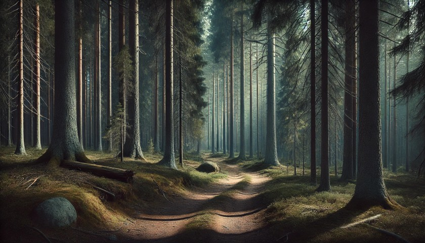

# [[Улюбленець]]

## Глава перша.

### Частина перша. Дім.

Аші закінчила хазяйнувати у вітальні, обтрусилася від пилу, задумливо підійшла до вікна і сіла на підвіконні. На вулиці був тихий та заспокійливий літній день. Сонячні промені мерехтливо пробивалися крізь поодинокі хмаринки і красиво підкреслювали одиноку осику що росла на пагорбі. Легкий вітерець колихав некошений луг. І навіть Великий Ліс на обрії, що завжди трохи лякав, та всім своїм видом застережував що зайве в нього краще не суватися — виглядав майже привітним і домашнім. Аші із сумом подивилася на стару занедбану ґрунтовку що вела до будинку — кущі реп'яшнику вже майже сховали її під своїм листям, проте ще де-інде дорога пробивалася назовні, нагадуючи про часи коли по ній було кому їздити. Але люди давно забули про це місце — хтось поїхав, хтось пішов. Останній гість був мабуть майже півтора роки тому — місцевий фермер Семуель. Його сім'я жила десь за пів години вже декілька поколінь. Діти, двійнята: Ліза та Стефан, Аші їх дуже любила — давно виросли і поїхали з острову. Дружина померла від хвороби кілька років тому. Семуель… Аші не знала що трапилось з Семуелєм. Того дождливого вечора він заїхав в гості, але навіть не заходив. Просто віддав ключі від будинку, попрощався, і не відповівши на жодне питання — поїхав. На всю округу вони залишились вдвох — з її домашньою улюбленкою Тіною. До початку цього літа.

Аші подивилася на тіні від реп'яшнику, ніби сподіваючись побачити Тіну. Потім струхнула головою — Тіна не прийде. Вже декілька місяців як вона пішла і не повернулась. Звісно і до цього бувало що Тіна пропадала на день, два, декілька разів — навіть майже на тиждень. Але вона завжди поверталась. І завжди зразу бігла до Аші — ластилася до неї, щось говорила — розповідала де вона була, що робила і як за нею сумувала. Звісно, Аші робила вигляд що розуміє все-все що Тіна їй каже, та в свою чергу казала що теж дуже-дуже сумувала, та просила більш так не робити. Мабуть, зі сторони, цей діалог між кішкою і дівчиною виглядав трохи кумедно, але, якщо подумати: коли поживеш разом стільки років — для спілкування і слова особливо не потрібні. З ними просто іноді простіше. Та й зі сторони дивитися не було кому.

Але того разу Тіна пішла й не повернулася. Аші безплідно кожен вечір чекала її біля дому, бігала шукала по навколишнім полям, навіть пішла до Великого Лісу — Тіни й сліду не було. Надія знову її побачити згасала повільно, але незворотно — Аші, при всій своїй романтичній натурі, була реалісткою. Хоча іноді, як от сьогодні, їй хотілось посидіти на підвіконні, і пороздивлятися околиці, уявляючи як з-за повороту несподівано вийде Тіна і побіжить до неї.

Сонце поволі йшло по небосхилу — день добігав краю, тіні почали подовжуватись та рожевіти, поодинокі хмаринки перетворилися на красиву стелю з купчастих гір. Аші розплющила очі і почала дивитись на захід сонця. Сон ще не до кінця відпустив її, але вона вже не пам'ятала що їй наснилось, розуміла тільки що щось приємне. Але сон потроху відходив, і з ним почало зникати й солодке відчуття спокою і щастя. Вона знову подивилась на вулицю — тінь від реп'яшнику майже повністю поховала дорогу. Аші зітхнула, хильнула головою, відганяючи залишки сну, та перевела погляд в середину будинку. «Це все — щось з минулого життя» — мимоволі подумала вона. Від цієї думки на душі зразу пусто, але… спокійно. «Це все — щось з минулого життя» — тепер вона це промовила в голос, відокремлюючи кожне слово. 

— Бувай. — сказала Аші будинку і подивилася на двері.

### Частина друга. Ліс.

Великий Ліс не задарма називався Великим. Наскільки знала Аші — він простягався смугою через весь острів, відокремлюючи Північні Гори та Столицю від південних селищ. Але він звався Великим не тільки через це. Вікові дерева сягали неба. Тут, на землі, між ними можна було побудувати цілий будинок, але там, нагорі, де вони торкалися сонця і мали можливість розкрити всю свою силу — вони це робили. Величезні крони, немов дах, застеляли все небо. Жодна злива, жоден буревій не міг пробитися через цю міць сюди, донизу. Поодинокі промінчики сонця досягали землі підсвітлюючи мшані пагорби та зарості чорничника. Підліску майже не було — жодне інше дерево не витримувало конкуренції з віковими соснами Великого Лісу — корінними власниками цієї землі. 

Аші йшла дорогою, обережно роздивляючись навколиці — в Великому лісі жили не менш великі звірі, як раптом почула скрип колес. Швидко сховавшись за деревом, Аші обережно виглянула зза стовбура. Дорогою їхав віз запряжений двома кіньми. На ко&#769;злах сидів сивий чоловік з пов'язкою на лівому оці.

«Цікаво. — подумала Аші. — Віз з кіньми? Де вони це знайшли?». Аші продовжувала обережно слідувати за несподіваними гістьми. Повозка зупинилася футів за шістдесят від сосни за котрою сховалася Аші. Чоловік накинув повіддя на поруччя, покопався під сидінням, дістав пляшку, відкупорив — та дробив смачний ковток. Потім подивився прямо в сторону Аші і промовив: «Я тебе бачу. А ще ти занадто голосно дихаєш» — Аші зомліла. 

— Давай знайомитися, — промовив одноокий. – Лестер. А тебе як звуть?

Аші обережно вийшла зза дерева. І мовчки подивилася на одноокого.

— Дуже приємно, — як ні в чому не бувало продовжував Лестер. — Заблукала, чи до міста йдеш?

— Так. — Аші обережно кивнула.

— Ну да, а що я сподівався почути коли питав, — посміхнувся Лестер. — Підвезти?

Аші нічого не відповіла.

— Диви, — Лестер показав пальцем небо. — Вже за полудень. Ти справді хочеш ночувати в лісі? 

Аші подивилася в гору — сонце вже перейшло зеніт. Було прям бачно як воно вже готувалося почати замальовувати верхівки дерев у рожевий колір.

— Тобі до міста ще день йти, якщо не більше, — продовжував Лестер. — Сідай позаду, на вантаж — там місця багато. 

Аші ще раз подивилася на Лестера, на віз та на дорогу. Вона ще ніколи не заходила до лісу так далеко. Максимум куди вона ходила пішки — через поля, до найближчого селища, за чверть дня дороги. Звідти можна було дістатися до міста на автобусі, але він ходив раз на тиждень… — і Аші не захотіла чекати. Що ж, якщо все зважити… Дорога з однооким виглядала більш безпечною, ніж перспектива самій ночувати в Великому Лісі.

— Ще раз запрошувати не буду. Їдьмо?

Аші обережно кивнула і пішла до возу.

— А ти не говорлива, — зауважив Лестер. — Може це й на краще.

### Частина третя. Віз.

Аші прокинулася, але не подала виду. Віз тихо їхав лісовою дорогою, Аші лежала на великій дерев'яній коробці з написами «ОБЕРЕЖНО — КРИХКЕ», та стрілкою «ВЕРХ ТАМ» — дбайливо спрямованою в горизонт. Лестер продовжував травити історії зі свого насиченого життя:

— … і ось тут я починаю панікувати. Розумієш, це ж був один з тих рутинних нічних патрулів. Нічого ж незвичайного, так? А тут цей стрьомний шелест з провулку. Серце калатає, інстинкти кричать — бий, а потім дивись. Але я обережно підходжу, готовий до всього. І тут, ні звідки, звичайний кіт — звичайнісінький сірий кіт — вискакує на мене. Трясця! Можливо, ти думаєш, що це ще нічого, але ця падлюка має такий блиск в очах, що ніби знає про мене ВСЕ! І ще щось, чого я і сам не знаю. І перш ніж я встигаю щось зрозуміти — як я заплутуюсь у власній мантії і падаю на спину! А воно вже тріумфально сидить на моїх грудях і дивиться мені прямесенько в очі! Мені потім знадобилося хвилин десять, щоб виплутатись та прийти до тями! З тих пір я пильно стежу за бездомними котами. Ніколи не знаєш, що може ховатися за тими невинними вусиками.

Тіна… Як це було приємно, лежати з Тіною… На грудях… Аші тихо заплакала.

— Трясця. Щось не те сказанув, — Лестер обернувся до Аші. — Вибач, бачу що тобі боляче. Але ти виберешся — такі як ти чи я завжди вибираємося. От у мене була історія, ти не повіриш. Коротше, дали одного разу мені групу студентів… 

Але Аші вже не слухала. Вона дивилася за спину Лестера, на дорогу. Десь там її чекає місто і нове життя. «Виберуся... Звісно виберуся, що ще робити. Вибач, Тіно…». Сонце вже зникло з неба, але все ще нагадувало про своє існування зафарбованими верхівками дерев. Повороти міняли один одне. Віз, що дбайливо похитував по дорозі, та далекий шерхіт крон робили своє діло. Аші знову заснула.

## Глава друга.

### Частина перша. Полон.

— Де вона, кажеш!? Хапай! 

Аші не встигла прийти до тями, як її грубо стягли з коробки, скинули та притисли до землі замотавши рота ганчіркою. Вона очманіло почала озиратися. Декілька молодиків в шкіряних куртках та штанях метушилися кругом воза. Один вже відводив коней в сторону, двоє відв'язували коробку.

— Швидше, тягни!
— Та не знімай поки. Почекай транспорт — зразу перекинемо.
— Мотузки підбери — кинь до воза. Разом спалимо. 
— Що з цією робити? — Один з молодиків вказав на Аші та подивився на Лестера. Лестер стояв поруч воза, крутячи в руках пляшку та відчужено спостерігаючи за метушнею.
— Мені вона зараз не потрібна. Але поки не вбивайте. Може потім — я скажу.
— Віддамо босу. Бос таких любить, — криво посміхнувся один з молодиків, судячи з усього — головний.
— Можна й босу, — задумливо відповів Лестер.

Він підійшов до Аші і подивився їй у вічі:

— Вибач, мала. Нічого особистого. Просто зайвий свідок. Чи шпигун, хоча… — не думаю. Знаєш: тримай друзів близько, а ворогів — ще ближче. Можливо, тобі просто не повезло опинитися в непотрібний час в непотрібному місці. Так буває.

В лісі почувся шум мотору. Лестер напрягся: 

— Це що? — подивився він на головного молодика.
— Транспорт. — Відповів той, прикурюючи цигарку.
— Який, збіса, транспорт?!! Машина?!!
— Ну да, іншого не знайшли. Колимага років сорокових — не хвилюйся.
— Умова була — жодних маглівських приколів! Жодних двигунів чи електрики! 
— Та воно старе, на дизелі. Там з електрики — хіба що ліхтарі.
— Ти розумієш що з цим вантажем ці ліхтарі вилізуть тобі боком, причому в прямому сенсі? 

Лестер поліз до кишені за стільниковим, потім подивився на Аші:

— Приберіть її.

Головний молодик кивнув одному з хлопців — той моментом підбіг до Аші і накинув їй на голову мішка.

### Частина друга. Бос.

Аші сиділа у якомусь підвалі, в кімнаті розділеною навпіл щільною решіткою. Насправді, вона не була впевнена що це саме це підвал, але інтуіція та важке повітря натякали на те що ймовірніше вона знаходиться все ж таки під землею ніж над. Жодних вікон — тільки великі металеві двері по інший бік грат. В кутку стояла вода та лежала половина жареної курки на тарілці — Аші не торкалась, хоча і була голодна.

Засув на дверях скрипнув — Аші кинулась до кутка і напружилася. Засув скрипнув останній раз, двері відчинилися і в приміщення зайшла висока статна людина у чорній куртці з капюшоном. Обережно зачинив двері, людина повернулася до Аші та скинула капюшон. На Аші дивилася дівчина з довгим чорним волоссям та проникливими зеленими очима, на дні котрих грала пустота та рішучість.

— Дибіли. І що мені з тобою тепер робити?

Вона підійшла до грат, присіла, просунула руку крізь решітку — відірвала шмат курки, так почала смачно його їсти. 

— Їж, не бійся. Не отруєно. 

Аші не поворухнулась. Дівчина доїла курку, викинула кістку в куток кімнати та присіла біля грат, опершись спиною на стінку.

— От розумієш. Вже понад двадцять років пройшло. Двадцять! А ці довбні ніяк не вгамуються. Жарти в них.

Дівчина дістала цигарку: «Не заперечуєш?» — та не дочікуючись відповіді запалила.

— Молодою була — дурною. Мамка в мене ще той фрукт була, хоча подумати — з цим кодлом і не такою станеш. А мене обожнювала — все дозволяла і дарувала. І одного разу, приводить вона мені дівчинку. Каже — на тобі подружку. Особисту. Буде в тебе тепер іще одне звірятко, і підморгнула. А в мене тоді було дві собаки, п'ять котів, папужник, своя конюшня, навіть два олені, уявляєш? Специфічний у мамки гумор був… А дівчинка молода, вродлива — білявка голубоока. Вся така тендітна та правильна. Біле ще любила дуже.

Вона затягнулася цигаркою і пустим поглядом вперлася в стінку навпроти.

— Хєрова історія у тієї дівчинки була. Був у неї хлопець, одноліток. Так його у неї лярва одна уве&#769;ла. А йому що — лярва хоч і не молода, проте з грошима: машину йому подарувала, будинок. І на мет підсадила — щоб не втік. Це я потім вже дізналася. Лярва та — відома особа в вузьких кругах була, — дівчина глянула на Аші. — Порошком торгувала на пів світу. «Біла королева» себе величала. Ага, «Королева». Ми заочі її «Cніжком» називали, — дівчина посміхнулася. – Та ще кулька була. 

— Вони не місцеві були, десь с півдня, — продовжила дівчина. — Пів Європи за хлопцем своїм проїздила — повернути хотіла. Вже на грані була: їсти — хочеться, а вона така ж вся правильна… Пішла роботу на ніч шукати — і мамку мою зустріла. Та прямо з рук якихось двох вилупуків тоді її вирвала. Стрельнуло у неї щось тоді…

Дівчина затушила викинула цигарку об підлогу, стрельнула недопалок до кістки, та підпалила другу.

— Привела вона її до мене. Типу — буде тобі іграшка, а потім може й зробиш з неї для себе щось путне. Мамка бачила, що дівчина то насправді сильна і розумна — просто за коханням голову втратила. Не вгадала. Мене тоді так на цю всю романтику розвезло, що я сімейний бізнес ледве в прірву не спустила. Зі «Cніжком» потім ще років зі п'ять гризлися. З тих пір — жодних подружок чи звіряток, — дівчина зробила глибоку тягу. — Хоча свого хлопця вона таки повернула…

Дівчина встала, потягнулася та тупнула ногою. 

— Це сто років тому було! А ці довбні пам'ятають! Навіть ті, котрі тоді ще під стіл пішки ходили, знають цю історію! І постійно! Постійно тягнуть до мене дівчат, котів, собак, навіть оленя одного разу приперли!!! Щоб не забувала. Дибіли.

Вона протягнула руку до Аші: 

— Уіверпі. Це — датська. Можна просто Вів.

Нагорі роздався вибух, зі стелі посипалась штукатурка — світло блимнуло та погасло.
